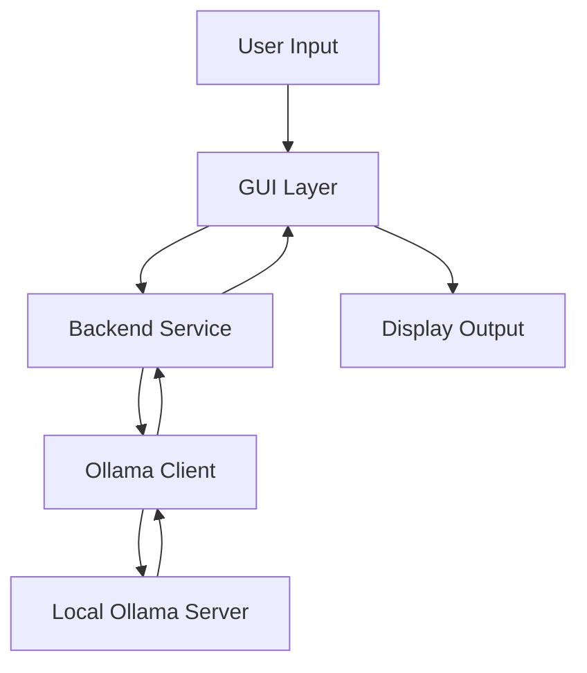

# Ollama Chat Application Architecture

## 1. Core Architecture

### Backend Layer
```
backend/
├── service.py          # Main backend service coordinator
├── ollama_client.py    # Handles Ollama API communication
├── chat_manager.py     # Manages chat sessions and messages
└── history_manager.py  # Handles chat history persistence
```

### GUI Layer
```
gui/
├── app.py             # Main application window
├── chat_window.py     # Chat interface component
├── model_selector.py  # Model selection component
└── theme_manager.py   # GUI theme management
```

### Utils Layer
```
utils/
├── config.py          # Application configuration
├── constants.py       # Shared constants
├── logging_config.py  # Logging configuration
└── async_helper.py    # Async utilities
```

## 2. Data Flow



## 3. Key Components

### Backend Service
- Central coordinator for all backend operations
- Manages component lifecycle
- Handles error propagation
- Provides clean API for GUI layer

### Chat Manager
- Manages chat sessions
- Handles message queuing
- Processes model responses
- Manages conversation context

### Model Selector
- Lists available models
- Handles model switching
- Validates model compatibility
- Provides model information

### Chat Window
- Displays messages
- Handles user input
- Shows typing indicators
- Manages message formatting

## 4. Performance Optimizations

### Async Operations
```python
async def send_message(self, message: str) -> str:
    """
    Asynchronously send message to model.
    Uses streaming for better responsiveness.
    """
    async with self._lock:
        return await self._stream_response(message)
```

### Resource Management
```python
def __init__(self):
    """
    Initialize with resource limits.
    Prevents memory/CPU overuse.
    """
    self._message_queue = asyncio.Queue(maxsize=100)
    self._worker_pool = ThreadPoolExecutor(max_workers=4)
```

### Caching Strategy
```python
@cached_property
def available_models(self) -> List[str]:
    """
    Cache available models.
    Refreshed only when needed.
    """
    return self._fetch_models()
```

## 5. Error Handling

### Layered Approach
```python
try:
    await self._process_message(msg)
except OllamaError as e:
    # Handle Ollama-specific errors
    self._handle_ollama_error(e)
except NetworkError as e:
    # Handle network-related errors
    self._handle_network_error(e)
except Exception as e:
    # Handle unexpected errors
    self._handle_unexpected_error(e)
```

## 6. Future Improvements

1. **Model Management**
   - Model version tracking
   - Auto-updates for models
   - Model performance metrics

2. **Chat Features**
   - Message threading
   - Code highlighting
   - File attachments
   - Image generation

3. **Performance**
   - Response streaming
   - Message batching
   - Background processing
   - Memory optimization
